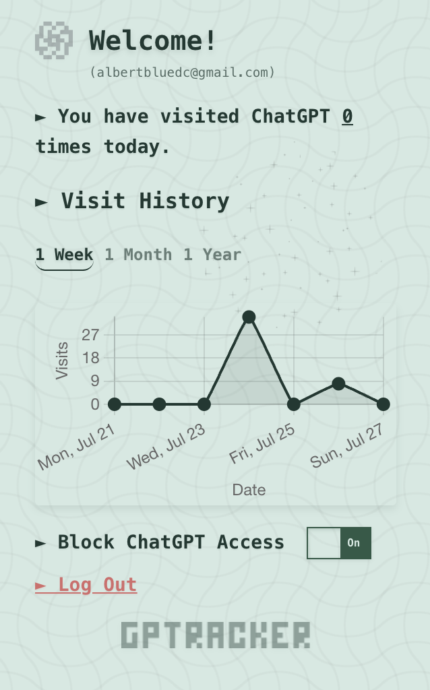
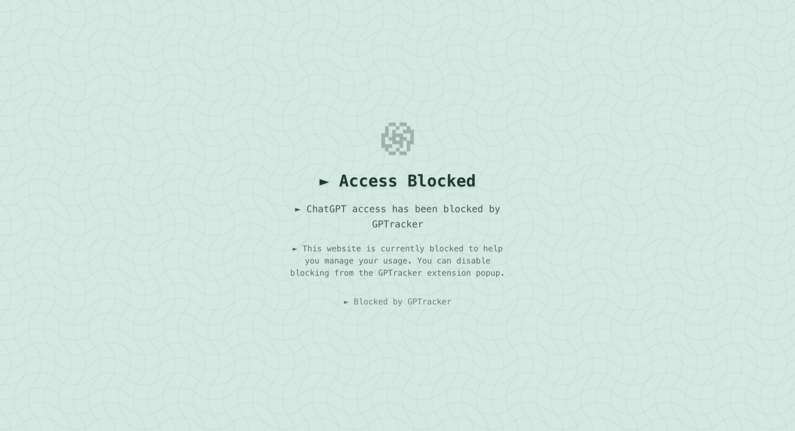

# GPTracker

GPTracker is a project I built in my free time for fun to practice my front-end development! It is a Chrome extension that tracks ChatGPT usage patterns with cloud synchronization and data visualization.

<div align="center">
  <table>
    <tr>
      <td align="center">
        
        <br/>
        <em>Dashboard with visit tracking and charts</em>
      </td>
      <td align="center">
        
        <br/>
        <em>ChatGPT blocking screen</em>
      </td>
    </tr>
  </table>
</div>

## Features

- **Visit Tracking**: Automatically counts visits to ChatGPT with intelligent per-tab tracking
- **Cloud Sync**: Secure data synchronization using Supabase with Google OAuth authentication
- **Data Visualization**: Interactive charts showing usage patterns over different time periods (1 week, 1 month, 1 year)
- **Access Control**: Optional ChatGPT blocking functionality
- **Daily Reset**: Automatic daily count reset with leftover count preservation
- **Offline Support**: Local storage fallback when offline

## Currently Working On

- **Chrome Web Store Publication**: Working on publishing the extension to make it easily accessible to users
- **Usage Categorization**: Extracting ChatGPT queries and classifying usage to promote conscious reflection about what the user relies on AI for
- **UI/UX Improvements**: Possibly adding a dark/light mode option
- **Enhanced Analytics**: Adding more detailed usage insights and patterns as widgets for users

## Installation

Unfortunately, to run the project, there needs to be Supabase credentials pertaining to the client which I can not provide. However, I am trying to publish this extension to the Chrome Web Store!

<!-- ### Prerequisites

- Node.js 18+ or Bun
- Chrome browser
- Supabase project (for cloud features)

### Development Setup

1. **Clone the repository**
   ```bash
   git clone <repository-url>
   cd GPTracker
   ```

2. **Install dependencies**
   ```bash
   bun install
   ```

3. **Environment Configuration**
   Create a `.env` file in the root directory:
   ```env
   VITE_SUPABASE_URL=your_supabase_project_url
   VITE_SUPABASE_ANON_KEY=your_supabase_anon_key
   ```

4. **Build the extension**
   ```bash
   bun run build
   ```

5. **Load in Chrome**
   - Open Chrome and navigate to `chrome://extensions/`
   - Enable "Developer mode"
   - Click "Load unpacked" and select the `dist` folder

### Production Build

```bash
bun run build
```

The built extension will be available in the `dist` folder, ready for distribution. -->

## Architecture

### Extension Structure

- **Popup Interface**: React-based UI (`src/App.tsx`) served as the extension popup
- **Background Script**: Service worker (`src/background.ts`) handles visit detection and counting
- **Content Script**: Minimal script (`src/content.ts`) for ChatGPT page interactions
- **Build System**: Vite with custom configuration for multi-entry Chrome extension builds

### Key Components

#### Visit Tracking System

- Per-tab visit tracking prevents double-counting
- 5-second throttle window per tab
- Intelligent detection of genuine page visits vs. refreshes
- Handles tab switching, navigation, and page reloads

#### Authentication & Sync

- Google OAuth integration through Supabase Auth
- Secure token-based API communication
- Automatic retry logic with exponential backoff
- Conflict resolution for offline/online data synchronization

#### Data Visualization

- Chart.js integration for interactive visualizations
- Multiple time period views (weekly, monthly, yearly)
- Data aggregation (daily to monthly for yearly view)
- Missing date handling with zero-fill

### Data Flow

1. **Visit Detection**: Background script monitors tab activations and URL changes
2. **Local Storage**: Immediate local storage of visit counts for responsiveness
3. **Cloud Sync**: Periodic synchronization with Supabase when authenticated
4. **Data Aggregation**: Chart data processing for different time periods
5. **UI Updates**: Real-time updates in popup interface

## Development

<!-- ### Available Scripts

```bash
# Development server with hot reload
bun run dev

# Production build
bun run build

# Code linting
bun run lint

# Preview built application
bun run preview
``` -->

### Project Structure

```
src/
├── components/          # React components
│   ├── authPanel.tsx   # Authentication interface
│   ├── dashboard.tsx   # Main dashboard component
│   └── VisitChart.tsx  # Chart visualization component
├── utils/              # Core utility functions
│   ├── dailyReset.ts   # Daily reset logic
│   ├── supabase.ts     # Supabase configuration
│   ├── timeUtils.ts    # Date/time utilities
│   └── visit_logic.ts  # Sync operations
├── App.tsx             # Main React app
├── background-simple.ts # Extension background script
└── content.ts          # Content script
```

### Chrome Extension Configuration

The extension uses Manifest V3 with the following permissions:

- `storage`: For local and sync storage
- `tabs`: For tab monitoring and URL detection
- `alarms`: For daily reset scheduling
- `host_permissions`: Access to ChatGPT domain

<!-- ## Supabase Integration

### Required Edge Functions

1. **update_visit_count**: Updates daily visit count with delta
2. **increment_last_visit_count**: Handles leftover counts from previous sessions
3. **read_curr_date_visit_count**: Fetches current day's visit count
4. **fetch_visit_history**: Retrieves historical visit data for charts -->

<!-- ### Database Schema

```sql
-- Users table for visit tracking
CREATE TABLE visits (
  id UUID DEFAULT gen_random_uuid() PRIMARY KEY,
  user_id UUID REFERENCES auth.users(id),
  date DATE NOT NULL,
  count INTEGER DEFAULT 0,
  created_at TIMESTAMP WITH TIME ZONE DEFAULT NOW(),
  updated_at TIMESTAMP WITH TIME ZONE DEFAULT NOW()
);

-- Indexes for performance
CREATE INDEX idx_visits_user_date ON visits(user_id, date);
CREATE UNIQUE INDEX idx_visits_user_date_unique ON visits(user_id, date);
```

### Authentication Setup

Enable Google OAuth in Supabase:
1. Configure Google OAuth provider in Supabase Auth settings
2. Set up redirect URLs for the Chrome extension
3. Configure RLS policies for the visits table -->

## Security Features

- **Content Security Policy**: Strict CSP preventing XSS attacks
- **Token-based Authentication**: Secure API communication using Supabase tokens
- **Row Level Security**: Database-level access controls
- **Local Data Encryption**: Sensitive data stored securely in Chrome storage
- **Permission Minimization**: Only requests necessary Chrome permissions

## Browser Compatibility

- **Chrome**: Fully supported (Manifest V3)
- **Edge**: Compatible with Chromium-based Edge
- **Firefox**: Not currently supported (requires Manifest V2 adaptation)

<!-- ## Troubleshooting

### Common Issues

1. **Sync Failures**
   - Check internet connection
   - Verify Supabase credentials
   - Check browser console for detailed error messages

2. **Visit Count Discrepancies**
   - Extension uses eventual consistency model
   - Local counts may temporarily differ from cloud
   - Sync occurs automatically when popup opens

3. **Build Issues**
   - Ensure Node.js 18+ or Bun is installed
   - Clear `node_modules` and reinstall dependencies
   - Check environment variables are properly set

### Debug Mode

Enable debug logging by opening the extension popup and checking the browser console for detailed sync and visit tracking information. -->

## Performance Considerations

- **Efficient Tab Monitoring**: Uses Chrome APIs efficiently to minimize battery impact
- **Throttled Sync**: Prevents excessive API calls with intelligent sync timing
- **Local-First**: Prioritizes local storage for responsiveness
- **Lazy Loading**: Charts and data load on-demand

<!-- ## Contributing

1. Fork the repository
2. Create a feature branch (`git checkout -b feature/amazing-feature`)
3. Commit your changes (`git commit -m 'Add amazing feature'`)
4. Push to the branch (`git push origin feature/amazing-feature`)
5. Open a Pull Request -->

## License

This project is licensed under the MIT License - see the LICENSE file for details.

## Privacy

GPTracker only tracks visits to ChatGPT and does not collect any personal data beyond what's necessary for functionality. All data is stored securely and users maintain full control over their information.
